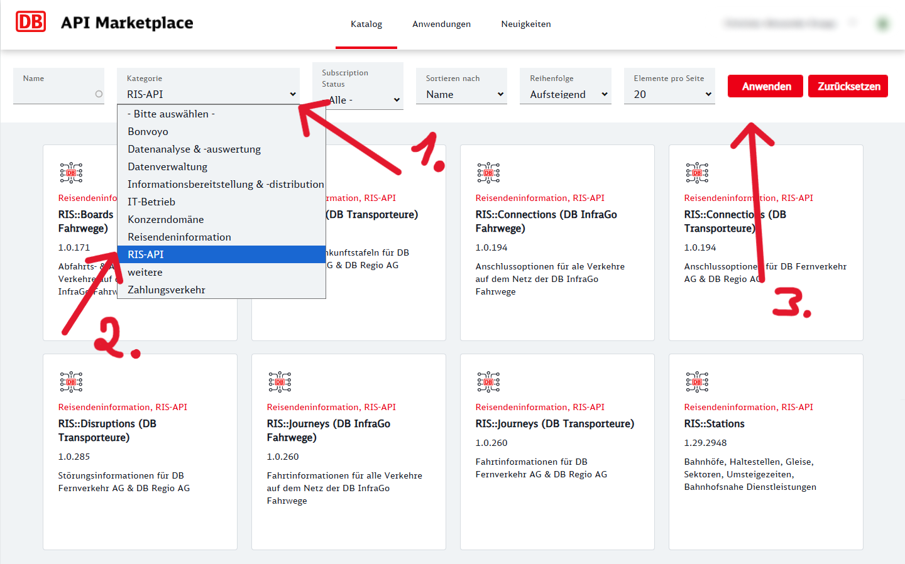
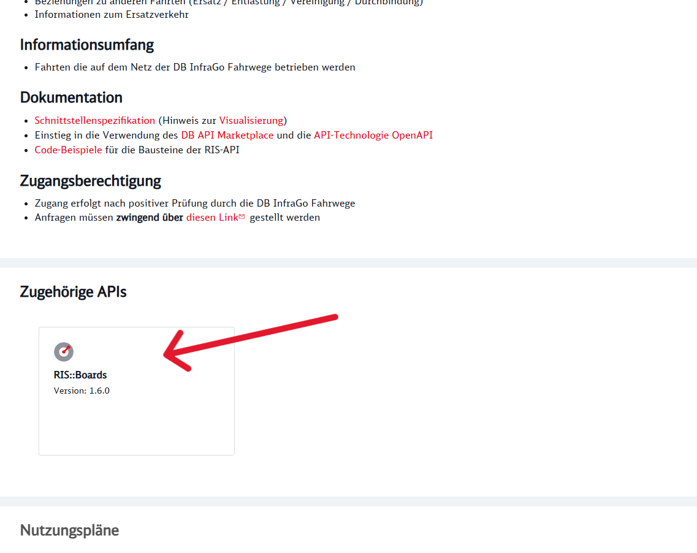
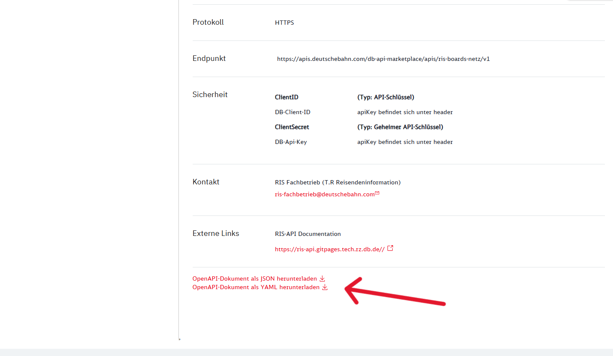

# Navigator.Data

This repository contains the core data layer for the **Navigator Backend**. It serves as the central library for all Database Entities and HTTP API Repositories, facilitating communication with internal databases and external third-party services.

## Model Generation Guide

When adding or updating models for the Deutsche Bahn third-party APIs (RIS), strictly follow the guide below.

1. **Obtain NSwag Tool**: Download and install the NSwag.ConsoleCore package from [NuGet](https://www.nuget.org/packages/NSwag.ConsoleCore).

2. **Go to the DB API Marketplace**: Navigate to the **"RIS-API"** category in the dropdown menu.
   

3. **Choose specific API**: Select the relevant API product (e.g. `RIS::Boards`, `RIS::Journeys`, `RIS::Stations`, etc.). Scroll down to the **Zugehörige APIs** (Associated APIs) section and click on the specific API you need.
   

4. **Download OpenAPI Specification**: Scroll down to the bottom of the page and use one of the download option to download the specification file (usually `.json` or `.yaml`).
   

5. **Generate Models using NSwag**: Use the NSwag.ConsoleCore CLI downloaded before to generate the C# client models from the downloaded specification. Run the following command, replacing `<path of the spec>` and `<output file>` with your specific paths:

   ```bash
   nswag openapi2csclient /input:<path of spec> /output:<output file>.cs /namespace:Navigator.Data /JsonLibrary:SystemTextJson
   ```

6. **Integration**: Take the generated model file and place it in the `Models/Ris` directory.

---
