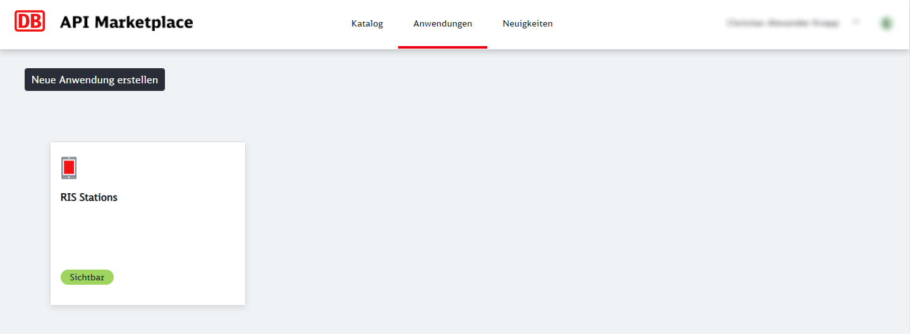
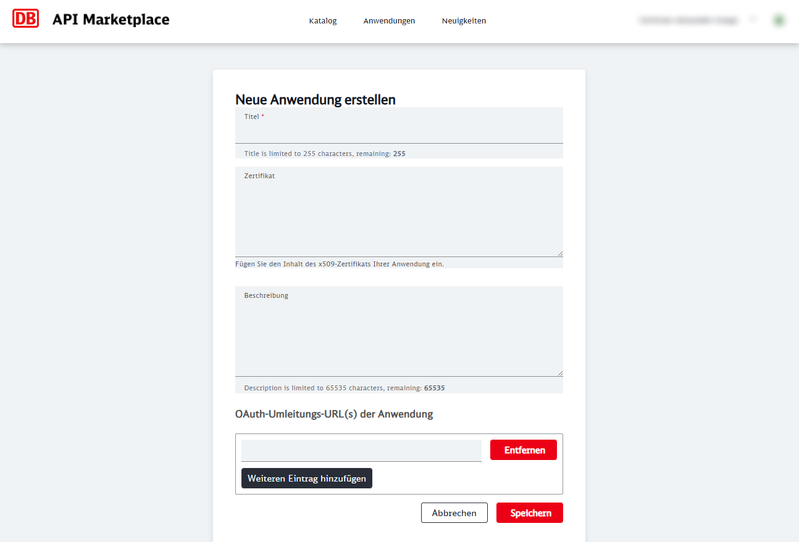
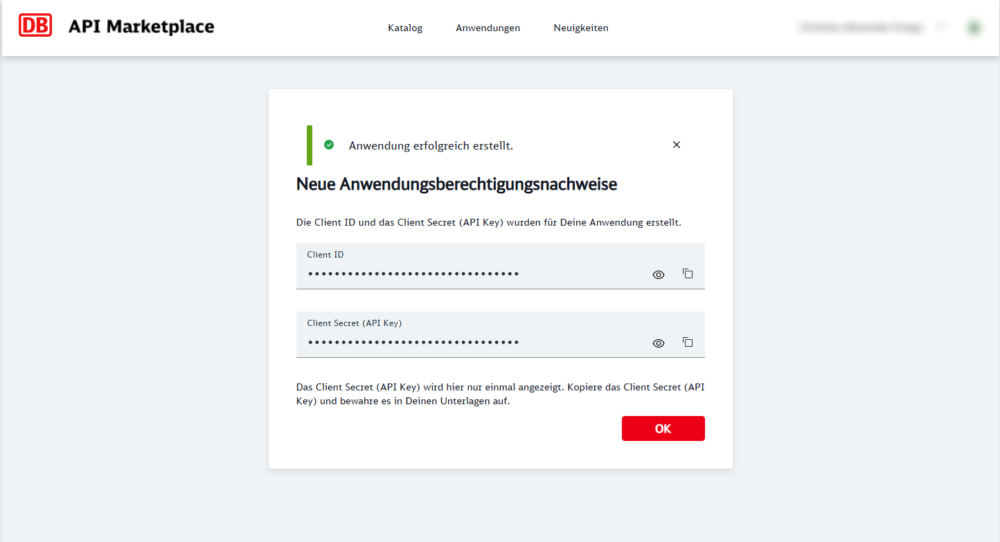
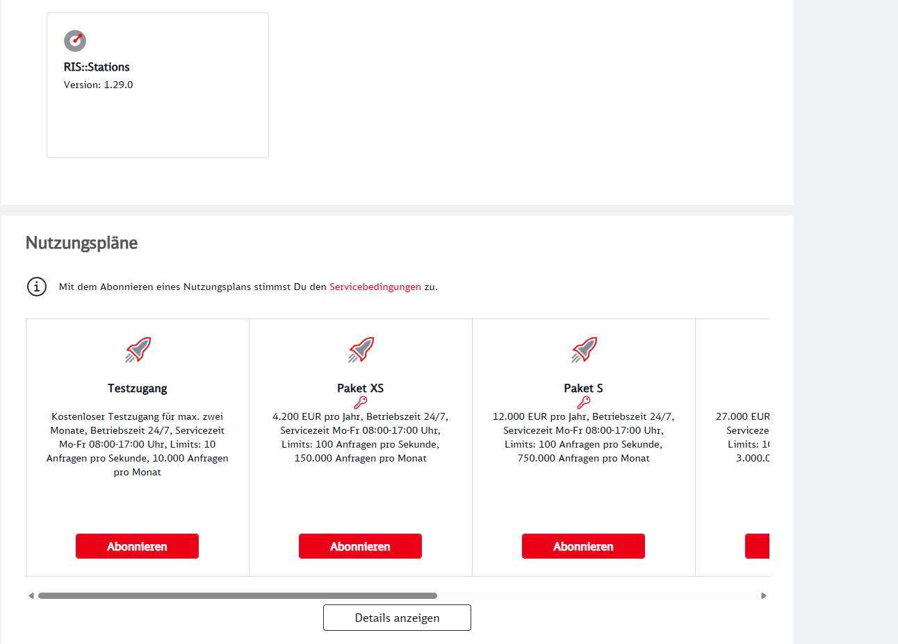

# Navigator.Preflight

**Navigator.Preflight** is the database seeding utility designed to bootstrap the ecosystem. Its primary purpose is to append migrations and populate the newly created database with stations gathered from the Deutsche Bahn **RIS::Stations** API and acts as a initialization script to ensure the core application has the necessary stations.

## Setup

Before executing, you must obtain valid credentials from the [DB API Marketplace](https://developers.deutschebahn.com/db-api-marketplace/apis/product). Please follow these steps:

### 1. Create a application

1. Log in to the Marketplace
2. Navigate to **"Anwendungen"**
3. Create a new application by filling in the required form fields.
   
   

### 2. Obtain Credentials

Once the application is created, locate and copy your:

- **Client ID**
- **Client Secret (API Key)**
  

### 3. Subscribe an API

1. Go to the **"Katalog"** again and select **`RIS::Stations`**.
2. Select a plan (e.g., **"Testzugang"**) and add it to your application you created in Step 1.
   

> **Note**: While many APIs on the DB API Marketplace require enterprise agreements or are restricted for end users, `RIS::Stations` offers a free plan for 2 months.

### 4. Local Environment Configuration

Open the `Properties/launchsettings.json` file and paste your credentials you obtained earlier.
