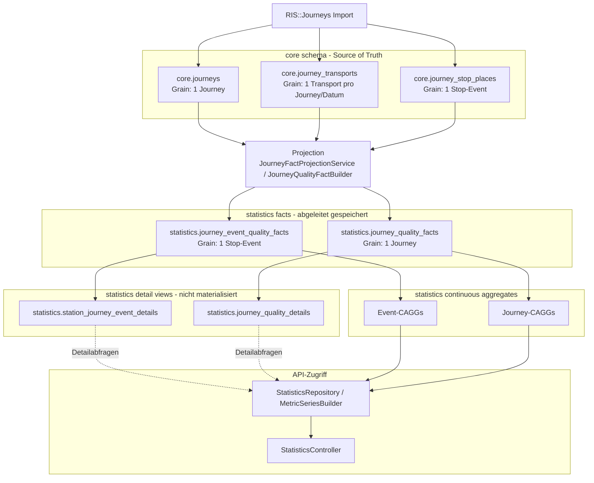

# Statistik- und API-Konzept für ein ÖPNV-/Fernverkehr-Dashboard

**Projektziel:** Darstellung der Leistung des öffentlichen Personen- und Fernverkehrs in Deutschland anhand von KPIs, Zeitreihen, Heatmaps, Rankings und MapLibre-Hotspots.

**Grundlage:**

- hochgeladenes Dashboard-Konzept für Hauptseite und Stationsseite
- aktuelle `Journey Statistics Data Hierarchy`
- ergänzende Architekturentscheidung: zusätzliche Statistikseiten für Linien und Fahrtnummern/Journeys

---

## 1. Fazit

Das Dashboard sollte nicht nur aus einer generischen Hauptseite und einer Stationsseite bestehen, sondern langfristig aus vier Statistik-Ebenen:

```text
1. Netzwerk / Generisch
2. Station
3. Linie
4. Journey / Fahrtnummer
```

Die ersten beiden Ebenen sind bereits im ursprünglichen Dashboard-Konzept angelegt. Linien- und Journey-spezifische Seiten sind die logische Erweiterung, weil die zentrale Leitfrage nicht nur nach der Gesamtleistung fragt, sondern auch nach Verkehrstyp, Station, Linie und Tageszeit.

Die wichtigste technische Entscheidung ist die klare Trennung zwischen:

```text
Event-Metriken   = Stop-Event-Qualität, z. B. Ausfall eines Halts oder Verspätung an einer Station
Journey-Metriken = Qualität einer ganzen Fahrt, z. B. Ziel erreicht, Zielverspätung, Teil- oder Vollausfall
```

Diese Trennung verhindert falsche Gewichtungen. Eine lange Linie mit vielen Stopps darf in globalen Linienrankings nicht automatisch stärker wirken als eine kurze Linie. Deshalb sollten globale Linienauswertungen primär auf Journey-Grain gelesen werden, während Stations- und Kartenansichten primär auf Event-Grain basieren.

---

## 2. Aktuelle Datenhierarchie

Die aktuelle Hierarchie ist sinnvoll und sollte beibehalten werden:



---

## 3. Grundbegriffe

### 3.1 Event-Grain

Ein Event ist ein geplanter Halt beziehungsweise ein geplantes Ereignis an einer Station.

Typische Felder:

```text
station_eva_number
planned_time
schedule_type
stop_cancelled
event_delay_seconds
transport_type
line_name / journey_description
journey_number
origin_eva_number
destination_eva_number
```

Event-Metriken eignen sich für:

```text
- Stationsseiten
- Deutschlandkarte
- Stationsrankings
- Linienranking an einer Station
- Ankunft-vs-Abfahrt-Auswertungen
- Stunde-x-Wochentag-Heatmaps
- Ausfallprofile auf Stoppebene
```

### 3.2 Journey-Grain

Eine Journey ist eine komplette Fahrt beziehungsweise ein Fahrtmuster.

Typische Felder:

```text
journey_number
line_name / journey_description
transport_type
origin_eva_number
destination_eva_number
journey_start_time
journey_end_time
fully_cancelled
partially_cancelled
destination_not_reached
destination_delay_seconds
```

Journey-Metriken eignen sich für:

```text
- globale Linienrankings
- Betreibervergleiche ohne Stop-Duplizierung
- Linienseiten
- Fahrtnummernseiten
- Zielpünktlichkeit
- Vollausfall / Teilausfall / Ziel nicht erreicht
```

---

## 4. Gemeinsame API-Konventionen

### 4.1 Datumsfilter

Alle Statistik-Endpunkte sollten mindestens diese Query-Parameter unterstützen:

```http
from=2026-01-01
to=2026-01-31
bucket=hour|day|week|month
```

Empfehlung:

```text
from inklusiv
to exklusiv
Zeitzone: Europe/Berlin
```

### 4.2 Gemeinsame Filter

```http
scheduleType=ARRIVAL|DEPARTURE
transportType=HIGH_SPEED_TRAIN|INTERCITY_TRAIN|INTER_REGIONAL_TRAIN|REGIONAL_TRAIN|CITY_TRAIN
lineName=MEX12
journeyNumber=19612
administration=DB_REGIO
originEvaNumber=8000141
destinationEvaNumber=8000096
state=Hessen
minVolume=1000
includeComparison=true
```

Nicht jeder Endpunkt muss jeden Filter unterstützen. Die API sollte aber einheitlich benennen.

### 4.3 Prozentwerte

Prozentwerte sollten im JSON als Dezimalwerte geliefert werden:

```json
{
  "customerReliability5Rate": 0.846
}
```

Das Frontend formatiert daraus:

```text
84,6 %
```

### 4.4 Zeitangaben

Zeitpunkte als ISO-8601 mit Offset:

```json
{
  "bucketStart": "2026-01-01T00:00:00+01:00"
}
```

Wiederkehrende Fahrplanzeiten als lokale Uhrzeit:

```json
{
  "scheduledStartTime": "06:12",
  "scheduledEndTime": "07:18"
}
```

---

## 5. Gemeinsame Metrikformate

### 5.1 EventMetrics

```json
{
  "plannedEvents": 120000,
  "cancelledEvents": 3600,
  "servedEvents": 116400,
  "cancellationRate": 0.03,
  "operativePunctuality5Rate": 0.872,
  "customerReliability5Rate": 0.846,
  "operativePunctuality15Rate": 0.951,
  "customerReliability15Rate": 0.922,
  "averageDelaySeconds": 180.4,
  "medianDelaySeconds": 42,
  "p95DelaySeconds": 1180,
  "p99DelaySeconds": 2600,
  "delayDebtMinutes": 42000,
  "late30Rate": 0.018,
  "late60Rate": 0.004
}
```

### 5.2 JourneyMetrics

```json
{
  "plannedJourneys": 8200,
  "completedJourneys": 7850,
  "fullyCancelledJourneys": 120,
  "partiallyCancelledJourneys": 180,
  "destinationNotReachedJourneys": 50,
  "fullCancellationRate": 0.0146,
  "partialCancellationRate": 0.0219,
  "destinationNotReachedRate": 0.0061,
  "journeyCompletionRate": 0.957,
  "destinationPunctuality5Rate": 0.801,
  "destinationPunctuality15Rate": 0.918,
  "averageDestinationDelaySeconds": 310,
  "medianDestinationDelaySeconds": 95,
  "p95DestinationDelaySeconds": 2100,
  "p99DestinationDelaySeconds": 4200,
  "destinationDelayDebtMinutes": 38000
}
```

### 5.3 Metrikdefinitionen

```text
servedEvents = plannedEvents - cancelledEvents

cancellationRate = cancelledEvents / plannedEvents

operativePunctuality5Rate = punctualServedEventsBelow6Min / servedEvents

customerReliability5Rate = punctualServedEventsBelow6Min / plannedEvents

operativePunctuality15Rate = punctualServedEventsBelow16Min / servedEvents

customerReliability15Rate = punctualServedEventsBelow16Min / plannedEvents

journeyCompletionRate = completedJourneys / plannedJourneys

destinationPunctuality5Rate = destinationPunctualJourneysBelow6Min / plannedJourneys

delayDebtMinutes = sum(max(delaySeconds, 0)) / 60
```

---

## 6. Übersicht der finalen Dashboard-Endpunkte

```text
GET /api/statistics/network/dashboard
GET /api/statistics/stations/{stationEvaNumber}/dashboard
GET /api/statistics/lines/{lineName}/dashboard
GET /api/statistics/journeys/{journeyNumber}/dashboard
```

| Seite | Zweck | Hauptgrain | Primäre Quellen |
|---|---|---|---|
| Netzwerk | Gesamtleistung Deutschland | Event + Journey | `network_event_quality_hourly`, `network_journey_quality_hourly` |
| Station | Qualität einer Station | Event | `station_event_quality_hourly`, `station_line_quality_hourly` |
| Linie | Qualität einer Linie | Journey + Event | `line_journey_quality_hourly`, `line_event_quality_hourly`, `station_line_quality_hourly` |
| Journey | Qualität einer Fahrtnummer | Journey + Stopprofil | `journey_number_quality_hourly`, `journey_quality_details`, `station_journey_event_details` |

---

# 7. Netzwerk-Dashboard

## 7.1 Leitfrage

```text
Wie gut funktioniert der öffentliche Personen- und Fernverkehr in Deutschland insgesamt — und wo sind die größten Probleme?
```

## 7.2 Anzeigen auf der Seite

```text
- KPI-Karten
- Zeitreihe
- Kalender-Heatmap
- Wochenzeit-Heatmap
- Vergleich nach Verkehrstyp
- Deutschlandkarte / MapLibre-Hotspots
- Top-Problemstationen
- Top-Problemlinien
- Verspätungsverteilung
- optional: System-Stress-Index
```

## 7.3 Endpoint

```http
GET /api/statistics/network/dashboard
```

## 7.4 Query-Parameter

```http
from=2026-01-01
to=2026-01-31
bucket=day
scheduleType=DEPARTURE
transportType=REGIONAL_TRAIN
administration=DB_REGIO
state=Hessen
minVolume=1000
includeComparison=true
```

## 7.5 Primäre Quellen

```text
network_event_quality_hourly
network_journey_quality_hourly
station_event_quality_hourly
line_journey_quality_hourly
journey_administration_quality_hourly
```

## 7.6 Response-Format

```json
{
  "meta": {
    "scope": "NETWORK",
    "from": "2026-01-01",
    "to": "2026-01-31",
    "bucket": "day",
    "timezone": "Europe/Berlin",
    "filters": {
      "scheduleType": "DEPARTURE",
      "transportTypes": ["REGIONAL_TRAIN"],
      "administrations": [],
      "state": "Hessen",
      "minVolume": 1000
    }
  },
  "eventKpis": {
    "plannedEvents": 12000000,
    "cancelledEvents": 360000,
    "servedEvents": 11640000,
    "cancellationRate": 0.03,
    "operativePunctuality5Rate": 0.872,
    "customerReliability5Rate": 0.846,
    "operativePunctuality15Rate": 0.951,
    "customerReliability15Rate": 0.922,
    "averageDelaySeconds": 180,
    "medianDelaySeconds": 42,
    "p95DelaySeconds": 1180,
    "p99DelaySeconds": 2600,
    "delayDebtMinutes": 420000
  },
  "journeyKpis": {
    "plannedJourneys": 820000,
    "completedJourneys": 785000,
    "fullyCancelledJourneys": 12000,
    "partiallyCancelledJourneys": 18000,
    "destinationNotReachedJourneys": 5000,
    "journeyCompletionRate": 0.957,
    "destinationPunctuality5Rate": 0.801,
    "destinationPunctuality15Rate": 0.918,
    "medianDestinationDelaySeconds": 95,
    "p95DestinationDelaySeconds": 2100,
    "destinationDelayDebtMinutes": 380000
  },
  "eventTimeSeries": [
    {
      "bucketStart": "2026-01-01T00:00:00+01:00",
      "plannedEvents": 390000,
      "cancellationRate": 0.027,
      "customerReliability5Rate": 0.851,
      "operativePunctuality15Rate": 0.953,
      "medianDelaySeconds": 39,
      "p95DelaySeconds": 1120
    }
  ],
  "journeyTimeSeries": [
    {
      "bucketStart": "2026-01-01T00:00:00+01:00",
      "plannedJourneys": 27000,
      "journeyCompletionRate": 0.961,
      "destinationPunctuality5Rate": 0.806,
      "medianDestinationDelaySeconds": 88,
      "p95DestinationDelaySeconds": 1980
    }
  ],
  "weekdayHourHeatmap": [
    {
      "weekday": 1,
      "hour": 7,
      "plannedEvents": 180000,
      "cancellationRate": 0.021,
      "customerReliability5Rate": 0.842,
      "p95DelaySeconds": 1320
    }
  ],
  "transportTypeComparison": [
    {
      "transportType": "REGIONAL_TRAIN",
      "eventMetrics": {
        "plannedEvents": 9000000,
        "cancellationRate": 0.031,
        "customerReliability5Rate": 0.834,
        "p95DelaySeconds": 1400
      },
      "journeyMetrics": {
        "plannedJourneys": 620000,
        "journeyCompletionRate": 0.951,
        "destinationPunctuality5Rate": 0.785,
        "p95DestinationDelaySeconds": 2300
      }
    }
  ],
  "stationRanking": [
    {
      "stationEvaNumber": 8000105,
      "stationName": "Frankfurt(Main)Hbf",
      "state": "Hessen",
      "plannedEvents": 125420,
      "cancellationRate": 0.031,
      "customerReliability5Rate": 0.792,
      "p95DelaySeconds": 1880,
      "delayDebtMinutes": 43210,
      "mainTransportType": "REGIONAL_TRAIN"
    }
  ],
  "lineRanking": [
    {
      "lineKey": "REGIONAL_TRAIN:MEX12",
      "transportType": "REGIONAL_TRAIN",
      "lineName": "MEX12",
      "representativeJourneyNumber": "19612",
      "journeyMetrics": {
        "plannedJourneys": 8120,
        "journeyCompletionRate": 0.942,
        "destinationPunctuality5Rate": 0.781,
        "p95DestinationDelaySeconds": 1760,
        "destinationDelayDebtMinutes": 38120
      },
      "eventMetrics": {
        "plannedEvents": 81200,
        "cancellationRate": 0.026,
        "customerReliability5Rate": 0.802,
        "delayDebtMinutes": 61100
      },
      "affectedStations": 42,
      "worstStation": {
        "stationEvaNumber": 8000096,
        "stationName": "Stuttgart Hbf"
      },
      "problemContribution": 17782
    }
  ],
  "mapHotspots": [
    {
      "stationEvaNumber": 8000105,
      "stationName": "Frankfurt(Main)Hbf",
      "latitude": 50.1071,
      "longitude": 8.6638,
      "state": "Hessen",
      "plannedEvents": 125420,
      "customerReliability5Rate": 0.792,
      "cancellationRate": 0.031,
      "p95DelaySeconds": 1880,
      "delayDebtMinutes": 43210
    }
  ]
}
```

---

# 8. Stations-Dashboard

## 8.1 Leitfrage

```text
Wie zuverlässig ist diese konkrete Station — wann, mit welchen Linien und in welche Richtungen gibt es Probleme?
```

## 8.2 Anzeigen auf der Seite

```text
- Stationskopf
- KPI-Karten
- Benchmark gegen Deutschland-Schnitt
- Zeitreihe
- Ankunft-vs-Abfahrt-Vergleich
- Stunde-x-Wochentag-Heatmap
- Linienranking an der Station
- Richtungsauswertung nach Ursprung/Ziel
- Verkehrstyp-Mix
- Linie-x-Stunde-Matrix
- Ausfallprofil
```

## 8.3 Endpoint

```http
GET /api/statistics/stations/{stationEvaNumber}/dashboard
```

Beispiel:

```http
GET /api/statistics/stations/8000105/dashboard
```

## 8.4 Query-Parameter

```http
from=2026-01-01
to=2026-01-31
bucket=day
scheduleType=ARRIVAL
transportType=REGIONAL_TRAIN
lineName=MEX12
journeyNumber=19612
directionEvaNumber=8000096
minVolume=100
```

## 8.5 Primäre Quellen

```text
station_event_quality_hourly
station_administration_quality_hourly
station_line_quality_hourly
journey_event_quality_facts bei Number-Filter
station_journey_event_details für Detailtabellen
```

## 8.6 Response-Format

```json
{
  "meta": {
    "scope": "STATION",
    "stationEvaNumber": 8000105,
    "from": "2026-01-01",
    "to": "2026-01-31",
    "bucket": "day",
    "timezone": "Europe/Berlin"
  },
  "station": {
    "stationEvaNumber": 8000105,
    "stationName": "Frankfurt(Main)Hbf",
    "latitude": 50.1071,
    "longitude": 8.6638,
    "state": "Hessen",
    "category": "A"
  },
  "eventKpis": {
    "plannedEvents": 125420,
    "arrivalEvents": 62710,
    "departureEvents": 62710,
    "cancelledEvents": 3887,
    "cancellationRate": 0.031,
    "operativePunctuality5Rate": 0.817,
    "customerReliability5Rate": 0.792,
    "operativePunctuality15Rate": 0.921,
    "medianDelaySeconds": 88,
    "p95DelaySeconds": 1880,
    "delayDebtMinutes": 43210
  },
  "benchmark": {
    "station": {
      "customerReliability5Rate": 0.792,
      "cancellationRate": 0.031,
      "p95DelaySeconds": 1880
    },
    "network": {
      "customerReliability5Rate": 0.853,
      "cancellationRate": 0.022,
      "p95DelaySeconds": 1210
    },
    "similarStations": {
      "customerReliability5Rate": 0.821,
      "cancellationRate": 0.026,
      "p95DelaySeconds": 1510
    }
  },
  "timeSeries": [
    {
      "bucketStart": "2026-01-01T00:00:00+01:00",
      "plannedEvents": 4012,
      "cancellationRate": 0.029,
      "customerReliability5Rate": 0.801,
      "p95DelaySeconds": 1730
    }
  ],
  "arrivalDepartureComparison": [
    {
      "scheduleType": "ARRIVAL",
      "plannedEvents": 62710,
      "cancellationRate": 0.03,
      "customerReliability5Rate": 0.781,
      "medianDelaySeconds": 102,
      "p95DelaySeconds": 2010
    },
    {
      "scheduleType": "DEPARTURE",
      "plannedEvents": 62710,
      "cancellationRate": 0.032,
      "customerReliability5Rate": 0.803,
      "medianDelaySeconds": 74,
      "p95DelaySeconds": 1740
    }
  ],
  "weekdayHourHeatmap": [
    {
      "weekday": 5,
      "hour": 17,
      "plannedEvents": 812,
      "customerReliability5Rate": 0.702,
      "cancellationRate": 0.041,
      "p95DelaySeconds": 2440
    }
  ],
  "lineRanking": [
    {
      "lineName": "MEX12",
      "journeyNumber": "19612",
      "transportType": "REGIONAL_TRAIN",
      "plannedEventsAtStation": 4120,
      "cancellationRate": 0.028,
      "customerReliability5Rate": 0.762,
      "operativePunctuality15Rate": 0.914,
      "medianDelaySeconds": 122,
      "p95DelaySeconds": 2130,
      "delayDebtMinutes": 6110,
      "stationDelayDebtShare": 0.141
    }
  ],
  "directions": [
    {
      "directionType": "DESTINATION",
      "evaNumber": 8000096,
      "stationName": "Stuttgart Hbf",
      "plannedEvents": 2310,
      "customerReliability5Rate": 0.741,
      "cancellationRate": 0.033,
      "p95DelaySeconds": 2290
    }
  ],
  "transportTypeMix": [
    {
      "transportType": "REGIONAL_TRAIN",
      "plannedEvents": 68200,
      "share": 0.544,
      "customerReliability5Rate": 0.812
    }
  ],
  "lineHourMatrix": [
    {
      "lineName": "MEX12",
      "journeyNumber": "19612",
      "hour": 17,
      "plannedEvents": 120,
      "customerReliability5Rate": 0.69,
      "p95DelaySeconds": 2500
    }
  ]
}
```

---

# 9. Linien-Dashboard

## 9.1 Leitfrage

```text
Wie zuverlässig ist eine Linie insgesamt, entlang ihrer Stationen, Richtungen und Fahrtnummern?
```

## 9.2 Fachliche Einordnung

Für die Linienseite sollte zwischen drei Ebenen unterschieden werden:

```text
Linie              = z. B. MEX12
Linienvariante     = MEX12 + Start + Ziel
Journey/Fahrtnummer = MEX12 + 19612 + Start + Ziel + geplante Startzeit
```

Das globale Line Ranking sollte primär die Linie betrachten, nicht jede einzelne Fahrtnummer als eigene Linie. Fahrtnummern gehören in den Drilldown.

## 9.3 Anzeigen auf der Seite

```text
- Linienkopf
- Journey-KPIs
- Event-KPIs entlang der Linie
- Zeitreihe
- Richtungen / Route-Varianten
- Stationsperformance entlang der Linie
- Journey-Number-Ranking
- Stunde-x-Wochentag-Heatmap
- Problemstationen
- Vergleich zur Netzwerkleistung
```

## 9.4 Endpoint

```http
GET /api/statistics/lines/{lineName}/dashboard
```

Beispiel:

```http
GET /api/statistics/lines/MEX12/dashboard
```

## 9.5 Query-Parameter

```http
from=2026-01-01
to=2026-01-31
bucket=day
transportType=REGIONAL_TRAIN
journeyNumber=19612
originEvaNumber=8000141
destinationEvaNumber=8000096
administration=DB_REGIO
minVolume=50
```

## 9.6 Primäre Quellen

```text
line_journey_quality_hourly
line_event_quality_hourly
station_line_quality_hourly
journey_number_quality_hourly bei Number-Filter
journey_quality_facts für globale Linien-Repräsentanten
```

## 9.7 Response-Format

```json
{
  "meta": {
    "scope": "LINE",
    "lineName": "MEX12",
    "from": "2026-01-01",
    "to": "2026-01-31",
    "bucket": "day",
    "timezone": "Europe/Berlin",
    "filters": {
      "transportType": "REGIONAL_TRAIN",
      "journeyNumber": null,
      "originEvaNumber": null,
      "destinationEvaNumber": null
    }
  },
  "line": {
    "lineName": "MEX12",
    "transportType": "REGIONAL_TRAIN",
    "representativeJourneyNumbers": ["19612", "19613", "19614"],
    "routeVariantCount": 4,
    "mainOrigin": {
      "stationEvaNumber": 8000141,
      "stationName": "Tübingen Hbf"
    },
    "mainDestination": {
      "stationEvaNumber": 8000096,
      "stationName": "Stuttgart Hbf"
    }
  },
  "journeyKpis": {
    "plannedJourneys": 8120,
    "completedJourneys": 7650,
    "fullyCancelledJourneys": 120,
    "partiallyCancelledJourneys": 270,
    "destinationNotReachedJourneys": 80,
    "journeyCompletionRate": 0.942,
    "destinationPunctuality5Rate": 0.781,
    "destinationPunctuality15Rate": 0.905,
    "medianDestinationDelaySeconds": 120,
    "p95DestinationDelaySeconds": 1760,
    "destinationDelayDebtMinutes": 38120
  },
  "eventKpis": {
    "plannedEvents": 81200,
    "cancelledEvents": 2104,
    "cancellationRate": 0.0259,
    "customerReliability5Rate": 0.802,
    "operativePunctuality15Rate": 0.921,
    "medianDelaySeconds": 95,
    "p95DelaySeconds": 1640,
    "delayDebtMinutes": 61100
  },
  "timeSeries": [
    {
      "bucketStart": "2026-01-01T00:00:00+01:00",
      "plannedJourneys": 260,
      "journeyCompletionRate": 0.95,
      "destinationPunctuality5Rate": 0.79,
      "plannedEvents": 2600,
      "customerReliability5Rate": 0.81,
      "p95DelaySeconds": 1500
    }
  ],
  "routeVariants": [
    {
      "variantKey": "MEX12:8000141:8000096",
      "origin": {
        "stationEvaNumber": 8000141,
        "stationName": "Tübingen Hbf"
      },
      "destination": {
        "stationEvaNumber": 8000096,
        "stationName": "Stuttgart Hbf"
      },
      "plannedJourneys": 4100,
      "journeyCompletionRate": 0.936,
      "destinationPunctuality5Rate": 0.742,
      "medianDestinationDelaySeconds": 140,
      "p95DestinationDelaySeconds": 2240
    }
  ],
  "stationPerformance": [
    {
      "stationEvaNumber": 8000096,
      "stationName": "Stuttgart Hbf",
      "sequenceHint": 12,
      "plannedEvents": 4100,
      "cancellationRate": 0.033,
      "customerReliability5Rate": 0.741,
      "medianDelaySeconds": 130,
      "p95DelaySeconds": 2290,
      "delayDebtMinutes": 11200
    }
  ],
  "journeyNumberRanking": [
    {
      "journeyNumber": "19612",
      "scheduledStartTime": "06:12",
      "scheduledEndTime": "07:18",
      "mainOrigin": {
        "stationEvaNumber": 8000141,
        "stationName": "Tübingen Hbf"
      },
      "mainDestination": {
        "stationEvaNumber": 8000096,
        "stationName": "Stuttgart Hbf"
      },
      "plannedJourneys": 31,
      "journeyCompletionRate": 0.903,
      "destinationPunctuality5Rate": 0.645,
      "p95DestinationDelaySeconds": 2600,
      "destinationDelayDebtMinutes": 4300
    }
  ],
  "weekdayHourHeatmap": [
    {
      "weekday": 1,
      "hour": 7,
      "plannedJourneys": 80,
      "destinationPunctuality5Rate": 0.72,
      "p95DestinationDelaySeconds": 2400
    }
  ],
  "problemStations": [
    {
      "stationEvaNumber": 8000096,
      "stationName": "Stuttgart Hbf",
      "problemContribution": 920,
      "delayDebtMinutes": 11200,
      "customerReliability5Rate": 0.741
    }
  ]
}
```

---

# 10. Journey-/Fahrtnummer-Dashboard

## 10.1 Leitfrage

```text
Wie performt eine konkrete Fahrtnummer beziehungsweise ein wiederkehrendes Fahrtmuster?
```

Diese Seite ist nicht zwingend Teil des MVP, aber ein sinnvoller Drilldown unterhalb der Linienseite.

## 10.2 Anzeigen auf der Seite

```text
- Journey-Kopf
- geplante Durchführungstage
- vollständig gefahren
- vollständig ausgefallen
- teilweise ausgefallen
- Ziel nicht erreicht
- Ziel-Pünktlichkeit 5/15
- Median/P95 Zielverspätung
- Tageskalender der Outcomes
- Verspätungsaufbau entlang der Stopps
- Stopprofil
- Vergleich zur Linie insgesamt
```

## 10.3 Endpoint

```http
GET /api/statistics/journeys/{journeyNumber}/dashboard
```

Beispiel:

```http
GET /api/statistics/journeys/19612/dashboard
```

## 10.4 Query-Parameter

```http
from=2026-01-01
to=2026-01-31
lineName=MEX12
transportType=REGIONAL_TRAIN
originEvaNumber=8000141
destinationEvaNumber=8000096
bucket=day
```

Hinweis: `lineName` und `transportType` sollten hier möglichst mitgesendet werden, weil eine `journeyNumber` nicht zwingend global eindeutig sein muss.

## 10.5 Primäre Quellen

```text
journey_number_quality_hourly
journey_quality_details
station_journey_event_details
journey_event_quality_facts für Stoppprofil
```

## 10.6 Response-Format

```json
{
  "meta": {
    "scope": "JOURNEY_NUMBER",
    "journeyNumber": "19612",
    "lineName": "MEX12",
    "transportType": "REGIONAL_TRAIN",
    "from": "2026-01-01",
    "to": "2026-01-31",
    "bucket": "day",
    "timezone": "Europe/Berlin"
  },
  "journeyPattern": {
    "journeyNumber": "19612",
    "lineName": "MEX12",
    "transportType": "REGIONAL_TRAIN",
    "scheduledStartTime": "06:12",
    "scheduledEndTime": "07:18",
    "mainOrigin": {
      "stationEvaNumber": 8000141,
      "stationName": "Tübingen Hbf"
    },
    "mainDestination": {
      "stationEvaNumber": 8000096,
      "stationName": "Stuttgart Hbf"
    },
    "observedServiceDays": 31,
    "routeVariantCount": 1
  },
  "journeyKpis": {
    "plannedJourneys": 31,
    "completedJourneys": 28,
    "fullyCancelledJourneys": 1,
    "partiallyCancelledJourneys": 2,
    "destinationNotReachedJourneys": 1,
    "journeyCompletionRate": 0.903,
    "destinationPunctuality5Rate": 0.645,
    "destinationPunctuality15Rate": 0.806,
    "averageDestinationDelaySeconds": 420,
    "medianDestinationDelaySeconds": 180,
    "p95DestinationDelaySeconds": 2600,
    "destinationDelayDebtMinutes": 4300
  },
  "dailyOutcomes": [
    {
      "serviceDate": "2026-01-02",
      "outcome": "COMPLETED",
      "destinationDelaySeconds": 420,
      "destinationPunctualityClass": "LATE_5",
      "fullyCancelled": false,
      "partiallyCancelled": false,
      "destinationNotReached": false
    }
  ],
  "stopProfile": [
    {
      "stationEvaNumber": 8000141,
      "stationName": "Tübingen Hbf",
      "plannedTime": "06:12",
      "scheduleType": "DEPARTURE",
      "plannedEvents": 31,
      "cancelledEvents": 1,
      "customerReliability5Rate": 0.71,
      "medianDelaySeconds": 60,
      "p95DelaySeconds": 900
    },
    {
      "stationEvaNumber": 8000096,
      "stationName": "Stuttgart Hbf",
      "plannedTime": "07:18",
      "scheduleType": "ARRIVAL",
      "plannedEvents": 31,
      "cancelledEvents": 2,
      "customerReliability5Rate": 0.645,
      "medianDelaySeconds": 180,
      "p95DelaySeconds": 2600
    }
  ],
  "delayBuildUp": [
    {
      "stationEvaNumber": 8000141,
      "stationName": "Tübingen Hbf",
      "medianDelaySeconds": 60,
      "p95DelaySeconds": 900
    },
    {
      "stationEvaNumber": 8000096,
      "stationName": "Stuttgart Hbf",
      "medianDelaySeconds": 180,
      "p95DelaySeconds": 2600
    }
  ],
  "calendar": [
    {
      "serviceDate": "2026-01-02",
      "status": "LATE_15",
      "destinationDelaySeconds": 1320
    }
  ]
}
```

---

# 11. GeoJSON-Endpunkt für MapLibre

Für MapLibre sollte ein eigener GeoJSON-Endpunkt existieren. Das ist sauberer als die Karte aus dem normalen Dashboard-JSON zu bauen.

## Endpoint

```http
GET /api/statistics/network/map-hotspots.geojson
```

## Query-Parameter

```http
from=2026-01-01
to=2026-01-31
metric=customerReliability5Rate
transportType=REGIONAL_TRAIN
scheduleType=DEPARTURE
minVolume=1000
```

## Format

```json
{
  "type": "FeatureCollection",
  "features": [
    {
      "type": "Feature",
      "id": "8000105",
      "geometry": {
        "type": "Point",
        "coordinates": [8.6638, 50.1071]
      },
      "properties": {
        "stationEvaNumber": 8000105,
        "stationName": "Frankfurt(Main)Hbf",
        "state": "Hessen",
        "plannedEvents": 125420,
        "cancellationRate": 0.031,
        "customerReliability5Rate": 0.792,
        "p95DelaySeconds": 1880,
        "delayDebtMinutes": 43210,
        "score": 0.792
      }
    }
  ]
}
```

MapLibre-Zuordnung:

```text
Punktgröße = plannedEvents
Farbe      = score / customerReliability5Rate / cancellationRate
Tooltip    = stationName + zentrale KPIs
```

---

# 12. Optionale Detail-Endpunkte

Für die erste Version können die Dashboard-Endpunkte groß genug sein. Später lohnt sich eine feinere Aufteilung, damit Svelte bei Filteränderungen nicht immer alles neu laden muss.

## 12.1 Netzwerk

```http
GET /api/statistics/network/time-series
GET /api/statistics/network/weekday-hour-heatmap
GET /api/statistics/network/transport-types
GET /api/statistics/network/station-ranking
GET /api/statistics/network/line-ranking
GET /api/statistics/network/map-hotspots
```

## 12.2 Station

```http
GET /api/statistics/stations/{stationEvaNumber}/time-series
GET /api/statistics/stations/{stationEvaNumber}/arrival-departure
GET /api/statistics/stations/{stationEvaNumber}/line-ranking
GET /api/statistics/stations/{stationEvaNumber}/directions
GET /api/statistics/stations/{stationEvaNumber}/line-hour-matrix
GET /api/statistics/stations/{stationEvaNumber}/event-details
```

## 12.3 Linie

```http
GET /api/statistics/lines/{lineName}/time-series
GET /api/statistics/lines/{lineName}/route-variants
GET /api/statistics/lines/{lineName}/stations
GET /api/statistics/lines/{lineName}/journey-numbers
GET /api/statistics/lines/{lineName}/weekday-hour-heatmap
```

## 12.4 Journey

```http
GET /api/statistics/journeys/{journeyNumber}/daily-outcomes
GET /api/statistics/journeys/{journeyNumber}/stop-profile
GET /api/statistics/journeys/{journeyNumber}/delay-build-up
```

---

# 13. Mapping: API-Frage zu Datenquelle

| API-Frage | Primäre Quelle | Begründung |
|---|---|---|
| Netzwerk-Zeitreihe Event-basiert | `network_event_quality_hourly` | Stop-Event-Metriken ohne Stationsdimension |
| Netzwerk-Zeitreihe Journey-basiert | `network_journey_quality_hourly` | Journey-Qualität ohne Stop-Duplizierung |
| Stations-Zeitreihe | `station_event_quality_hourly` | Stop-Event-Metriken an konkreter Station |
| Stations-Summary | `station_event_quality_hourly` | Aggregation über Zeitraum bleibt Event-basiert |
| Betreiber-Ranking mit Stationsfilter | `station_administration_quality_hourly` | Betreibervergleich an Station auf Stop-Grain |
| Betreiber-Ranking global | `journey_administration_quality_hourly` | Betreibervergleich auf Journey-Grain |
| Linien-Ranking mit Stationsfilter | `station_line_quality_hourly` | Linienvergleich an Station auf Stop-Grain |
| Linien-Ranking mit Stationsfilter und Number-Filter | `journey_event_quality_facts` | `number` ist keine normale Dimension der Station-Line-CAGG |
| Linien-Ranking global | `line_journey_quality_hourly` | Linienvergleich ohne Stop-Duplizierung |
| Linien-Ranking global mit Number-Filter | `journey_number_quality_hourly` | Fahrtnummer als eigene CAGG-Dimension |
| Linie: Stationen entlang der Linie | `station_line_quality_hourly` / `line_event_quality_hourly` | Event-Grain für Stopprofil |
| Journey: Tagesoutcomes | `journey_quality_details` | Exakte Outcome-Informationen |
| Journey: Stopprofil | `station_journey_event_details` | Exakte Stopps und geplante Zeiten |

---

# 14. Empfehlungen für CAGGs und Facts

## 14.1 Facts

Facts sollten keine aggregierten Counts oder Summen speichern.

Sie speichern nur stabile, deterministische Auswertungsfelder:

```text
Event-Fact:
- station_eva_number
- planned_time
- schedule_type
- stop_cancelled
- event_delay_seconds
- transport_type
- line_name
- journey_number
- origin_eva_number
- destination_eva_number

Journey-Fact:
- journey_number
- line_name
- transport_type
- origin_eva_number
- destination_eva_number
- journey_start_time
- journey_end_time
- fully_cancelled
- partially_cancelled
- destination_not_reached
- destination_delay_seconds
```

## 14.2 CAGGs

CAGGs speichern additive Werte:

```text
planned_count
cancelled_count
served_count
punctual_5_count
punctual_15_count
late_30_count
late_60_count
delay_sum_seconds
positive_delay_sum_seconds
delay_sample_count
```

Rates und Averages werden beim Lesen berechnet.

## 14.3 Quantile

Für Median, P95 und P99 reicht `delay_sum_seconds` nicht.

Mögliche Lösungen:

```text
1. separate Quantil-Aggregationen
2. Histogramm-Buckets
3. t-digest / approximate percentiles
4. kontrollierter Rohdatenzugriff für seltene Detailabfragen
```

Für Dashboard-KPIs sollten Quantile vorbereitet oder approximiert vorliegen.

---

# 15. MVP-Empfehlung

## 15.1 MVP 1: Netzwerk-Dashboard

```text
1. KPI-Karten
2. Zeitreihe
3. Wochenzeit-Heatmap
4. Vergleich nach transport_type
5. Top-Problemstationen
6. Top-Problemlinien
7. MapLibre-Hotspots
```

## 15.2 MVP 2: Stations-Dashboard

```text
1. Stationskopf
2. KPI-Karten
3. Vergleich gegen Deutschland-Schnitt
4. Stations-Zeitreihe
5. Ankunft vs. Abfahrt
6. Stunde-x-Wochentag-Heatmap
7. Linienranking an der Station
8. Richtungsauswertung
```

## 15.3 MVP 3: Linien-Dashboard

```text
1. Linienkopf
2. Journey-KPIs
3. Event-KPIs entlang der Linie
4. Route-Varianten
5. Stationsperformance entlang der Linie
6. Journey-Number-Ranking
7. Problemstationen
```

## 15.4 Später: Journey-Dashboard

```text
1. Journey-Kopf
2. Tagesoutcomes
3. Stopprofil
4. Verspätungsaufbau
5. Vergleich zur Linie
```

---

# 16. Schlussfazit

Die Zielarchitektur sollte so aussehen:

```text
Frontend Svelte:
- rendert nur noch vorbereitete Dashboard-Blöcke
- berechnet keine schweren Metriken
- nutzt MapLibre über GeoJSON
- nutzt einzelne Dashboard-Endpunkte pro Statistikseite

ASP.NET API:
- liest aus CAGGs und Detail-Views
- berechnet Rates, Averages und Scores beim Lesen
- trennt Event-Metriken und Journey-Metriken
- liefert stabile JSON-Formate

Database:
- core bleibt Source of Truth
- Facts sind deterministisch abgeleitet
- CAGGs speichern additive Metriken
- Detail-Views liefern exakte Zeiten und Outcomes
```

Die finale Seitenstruktur lautet:

```text
/api/statistics/network/dashboard
/api/statistics/stations/{stationEvaNumber}/dashboard
/api/statistics/lines/{lineName}/dashboard
/api/statistics/journeys/{journeyNumber}/dashboard
```

Für das MVP sollten zuerst Netzwerk-, Stations- und Linien-Dashboard gebaut werden. Das Journey-Dashboard ist der sinnvolle Drilldown, sobald Linien- und Stationsdiagnosen stabil funktionieren.
